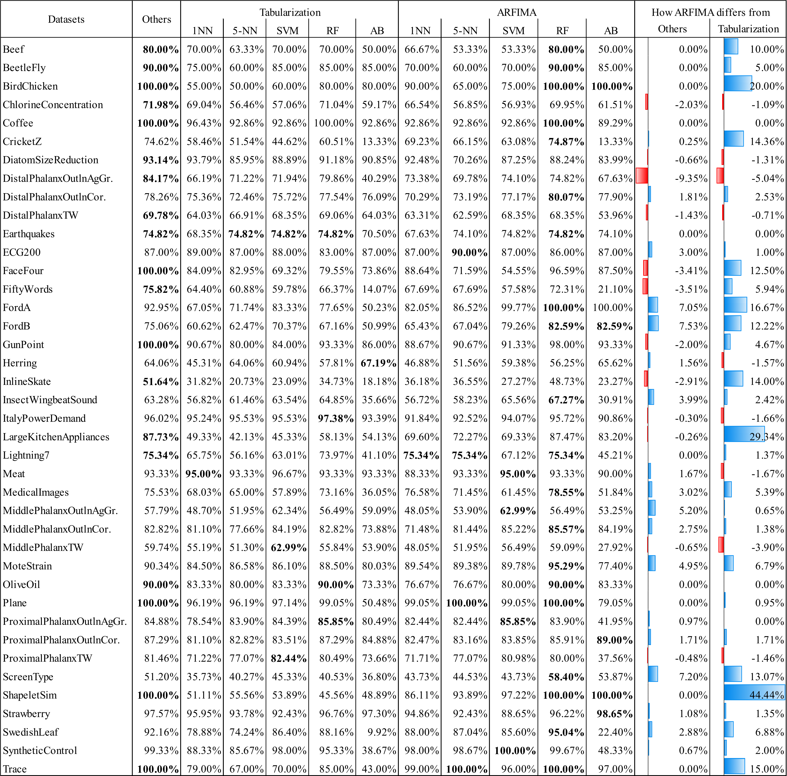
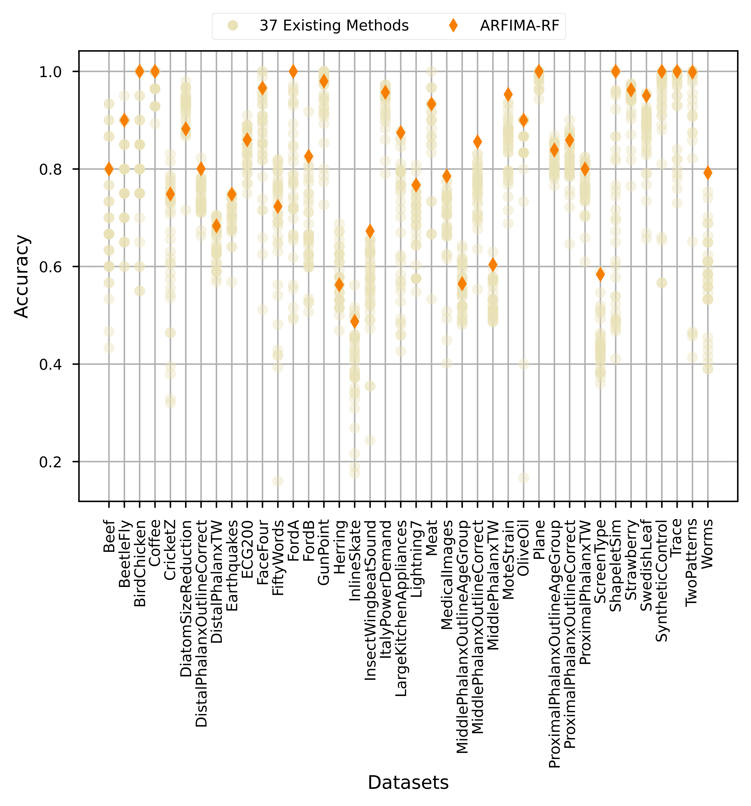

# ARFIMA Method 

**Autoregressive Fractionally Integrated Moving Average for Feature-Based Time Series Classification**

## Requirements
We used python 3.8.5. All python packages needed are listed in [requirements.txt](requirements.txt) file  and can be installed simply using the pip command. How to install dependencies? assuming that you have `python3` and `pip3` installed, third-party packages can be installed with:

```
pip3 install -r requirements.txt --upgrade --user
```

* [pandas](https://pandas.pydata.org/)
* [numpy](https://numpy.org/)
* [sklearn](https://scikit-learn.org/stable/)
* [statsmodels](https://www.statsmodels.org/stable/index.html)
* [sktime](https://github.com/alan-turing-institute/sktime)
* [pmdarima](https://pypi.org/project/pmdarima/)

## How to run on particular dataset?

The program is prepared to easily use datasets in a `*.arff` format obtained from [timeseriesclassification.com](http://timeseriesclassification.com), steps: 1) Having two `*.arff` files named `YourDataSet_TRAIN.arff` and `YourDataSet_TEST.arff`, place them in `datasets/` directory, and 2) run `python classify.py YourDataSet` to classify data based on test set.

Note: `YourDataSet` is a name of particular dataset from the website.

## How to run all data sets from directory folder?

You can run `python run_all.py` to test the classifier on every data set from `datasets/` folder.

Please note that this script might only run on Windows systems.

## Results
<p align="center">
  
</p>

<p align="center">
  
</p>
